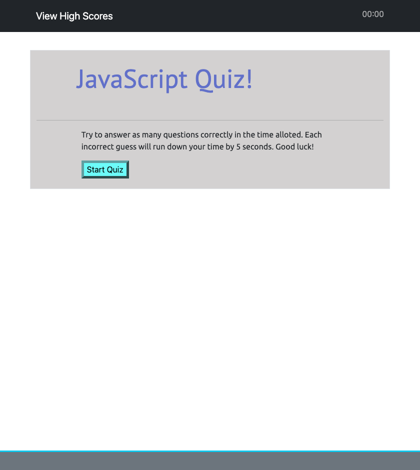
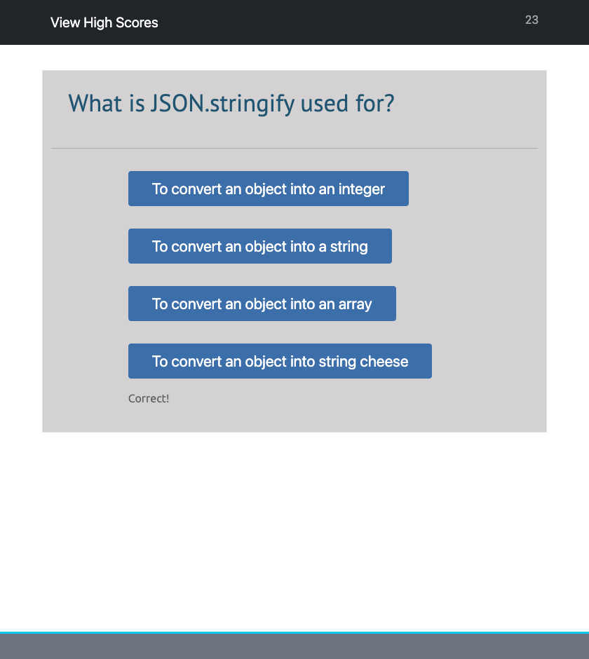
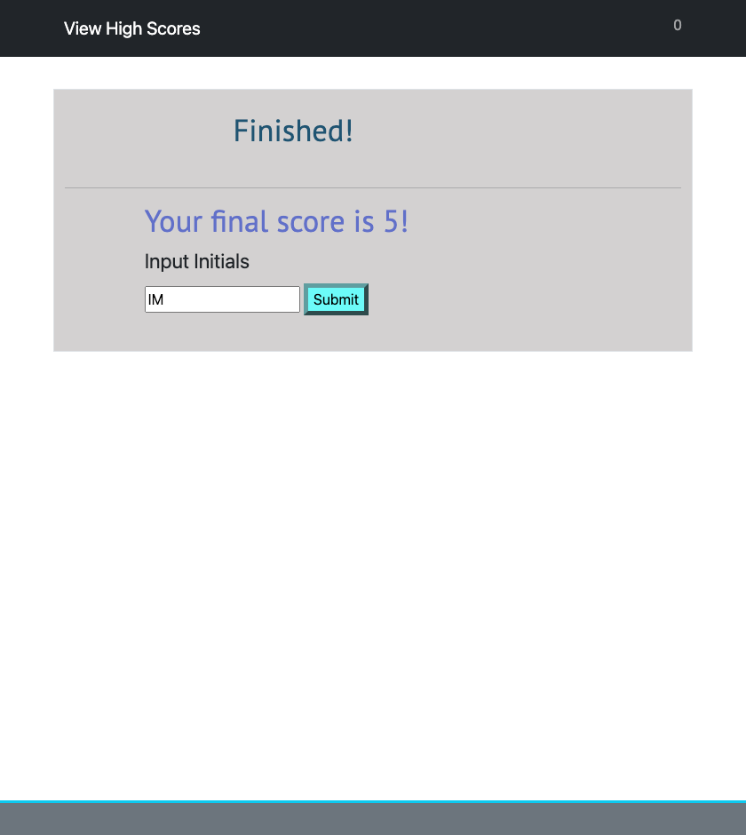
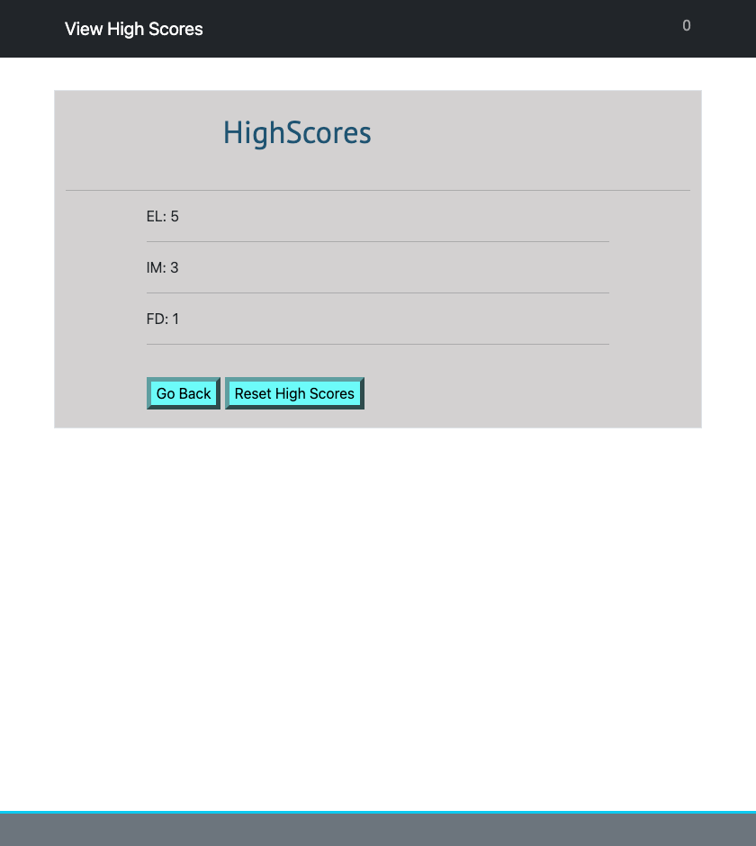

# JavaScript Quiz

## Task

As a coding boot camp student, I wanted to make a quiz on JavaScript fundamentals that stored high scores. This way I can gauge my progress compared to my peers.

## The Application

To accomplish this task, I've created an application, using mainly JavaScript, that administers a quiz to the user. The application works as follows:

* When the user clicks the start button, a timer starts, and they are presented with the first question.

* When they answer the first question, they are presented with another.

* If they get a question wrong, 5 seconds is subtracted from the timer.

* When all questions are answered or the timer reaches 0, the game is over, and the user is prompted to save their initials and score.

* The initials and scores are stored locally and are shown in the high score page.

* The user may reset the high scores using the reset button

* The user may view the high scores at any time by clicking the "View High Scores" button on the top left

## Below is a link to the finished application along with screenshots of quiz

### [JavaScript Quiz](https://israel-molestina.github.io/javascript-quiz/)

## Start

## Questions

## Finished

## High Score

